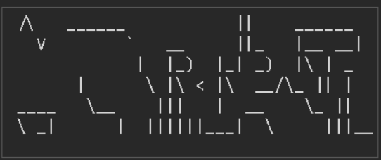
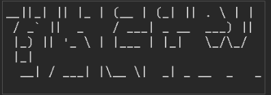

# TINAC
TINAC: **T**inac **I**s **N**ot **A** **C**aptcha
<video controls src="2025-12-27 20-19-41.mp4" title="video example"></video>

## How to deploy

### Part 1: Hosting the TINAC Server

First, clone this repo.

```bash
git clone https://github.com/itzmetanjim/tinac
```

Then, cd into the directory.

```bash
cd tinac
```

Then, make a virtual environment

```bash
python3 -m venv venv # time: 1-3 mins
```

Then, install the requirements.

```bash
pip install -r requirements.txt
# If fails, use python3 -m pip
```

#### Part 1.1: Configuration

Copy `config.json.example` to `config.json`.
```bash
cp config.json.example config.json
```

Then, edit `config.json` to your liking. It should look like:
```json
{
    "good_fonts": ["standard"],
    "chars": "ABCEFGHJKMNPRSTLabcdefghijkmnopqrstuvwxyz",
    "deceptor": "markov2d",
    "__comment__":"Use 'markov2d','markov','random' or a custom deceptor module name (must have the function generate_decoy(linelen,lineheight,realtext) defined).",
    "charlens":[5,6,7],
    "steps":20,

    "audio_engine":"audiogen",
    "gap":"50%",
    "audio_steps":20,
    "jwt_secret":"CHANGE_THIS_CHANGE_THIS_CHANGE_THIS_CHANGE_THIS",
    "allowed_types":["legacy","image","audio"],
    "training_settings":{
        "memory":5,
        "examples":1000
    }
}
```
Fields:
- `good_fonts`: List of FIGlet fonts to use for captchas.
- `chars`: Characters to use in captchas.
- `deceptor`: The decoy text generator to use. You can also make your own module with the function `generate_decoy(linelen,lineheight,realtext)`. A comparision will be shown in part 1.2.
- `charlens`: List of lengths of captchas to generate.
- `steps`: Number of steps to add in the slider
- `audio_engine`: The audio engine to use. You can make your own module similar to `audiogen.py`
- `gap`: Gap between audio segments. Can be a percentage (e.g. "50%") or a fixed time in ms (e.g. "300")
- `audio_steps`: Number of steps to add in the audio slider
- `jwt_secret`: Secret key for signing JWT tokens. **Change this to a secure random string!**
- `allowed_types`: List of allowed captcha types. Options are "legacy", "image", "audio".
- `training_settings`: Settings for training the decoy text generator.
  - `memory`: Memory size for the Markov model. Ignored in 2D chains.
  - `examples`: Number of training examples to use.
     Calculate the needed number of examples according to memory as: $E = 2^{2m}$
     
- `__comment__`: Just a comment, ignored by the program. You can add as many extra keys as you would like for use within your own config module.

#### Part 1.2: Training
Run:
```bash
python trainchain.py
```
for a 1D markov chain. If you are using 2D Markov chain, run:
```bash
python trainchain2d.py
```
Decoy comparisions:
- Markov 2D: 
- Normal 1D markov: 

Then you can run the backend.

#### Part 1.3 Running the server
For production, always use systemctl (method 1.3.3)
#### Method 1.3.1: Simple test run

```bash 
python3 backend.py
```

#### Method 1.3.2: Using something to make it run even after you SSH out

##### Method 1.3.2.1 Using `nohup`
Run with:
```bash
nohup python3 backend.py
```

Check logs:
```bash
cat nohup.out
```

Terminate:
```bash
ps -aux | grep "python backend.py`
# look at the output
kill <pid>
```

##### Method 1.3.2.2 Using `screen`

```bash
screen
```

Then, a new terminal session will open (like the screen will clear). Then type:

```bash
python3 backend.py
```

Then, press `^A^D` to exit out of `screen`. If it says:
```
[detached]
```
then you did it right. If it says:
```
[screen is terminating]
```
Then you may have done something wrong.


If you did it right then you can safely `^D` out of your server.

Now, to check your logs or terminate:

```bash
screen -r
```

#### Method 1.3.3: Using `systemctl`(recommended for production)

This is recommended for production. To make the systemctl unit, do the following:
Create a file `/etc/systemd/system/tinac.service` with the following content:
```toml
[Unit]
Description=TINAC Service
After=network.target
[Service]
User=your_user_here # change this
WorkingDirectory=/path/to/tinac # change this
ExecStart=/path/to/tinac/venv/bin/python /path/to/tinac/backend.py # change this
Restart=always
[Install]
WantedBy=multi-user.target
```

Now, run:
```bash
sudo systemctl daemon-reload
sudo systemctl start tinac
sudo systemctl enable tinac
```
To check status:
```bash
sudo systemctl status tinac
```
It should say "active (running)".
To check logs:
```bash
sudo journalctl -u tinac -f
# press q to exit
```
To stop:
```bash
sudo systemctl stop tinac
```
To restart:
```bash
sudo systemctl restart tinac
```
### Part 2: The web server
(If you just want to test out the captcha go to Part 3)

In your web server, make the code for the captcha-protected endpoint. The logic is like:
```
[GET /captcha_protected]
check cookies for a token
 - if it exists, call the /verify_token endpoint of your TINAC server and check that
   - its valid
   - the captcha type is as expected
   - it is not expired
    - if all good, allow access to the endpoint
 - if it doesnt exist/is invalid show some captcha client page that adds the token to cookies on success
```
For example, in a FastAPI server, you can do:
```python
api_url = "http://localhost:3456"  # change this
@app.get("/captcha_protected")
async def captcha_protected(request: Request):
    token = request.cookies.get("tinac_token")
    if token:
        async with httpx.AsyncClient() as client:
            resp = await client.post(f"{api_url}/verify_token", json={"token": token, "expected_type": "image"})
            if resp.status_code == 200:
                data = resp.json()
                if data.get("valid"):
                    return {"message": "Access granted to captcha protected endpoint!"}
    # if we reach here, token is invalid or not present
    return HTMLResponse(content="""
    <html>
    <head>
        <script src="https://cdnjs.cloudflare.com/ajax/libs/axios/0.21.1/axios.min.js"></script>
    </head>
    <body>
        <!-- Make your client here, see part 3-->
    </body>
    </html>
    """, status_code=200)
```

### Part 3: The client
Currently we do not have an SDK so you have to make your own client. See `example.html` for an example to build it off of. Note that audio captchas are buggy as of now.

To use the example, simply download `example.html` into your device and open it. 
- Change the API URL to your TINAC server URL.
- Click "Fetch Captcha" to get an image captcha. Solve the captcha by sliding the slider untill the text is legible and entering the text. Then submit it.
- Click "Fetch Legacy Captcha" to get a legacy text captcha. Solve it by entering the text shown. This is not recommended as it may be easier for bots to go through
- "Fetch Audio Captcha' to get an audio captcha. Solve it by sliding the slider untill you can hear numbers (not words) clearly and entering the numbers. Then submit it.
- In either of these cases you should see "Answer correct, index correct, verifying token...` then the token should be verified correctly. (note that JWT token verification should be done server side)
